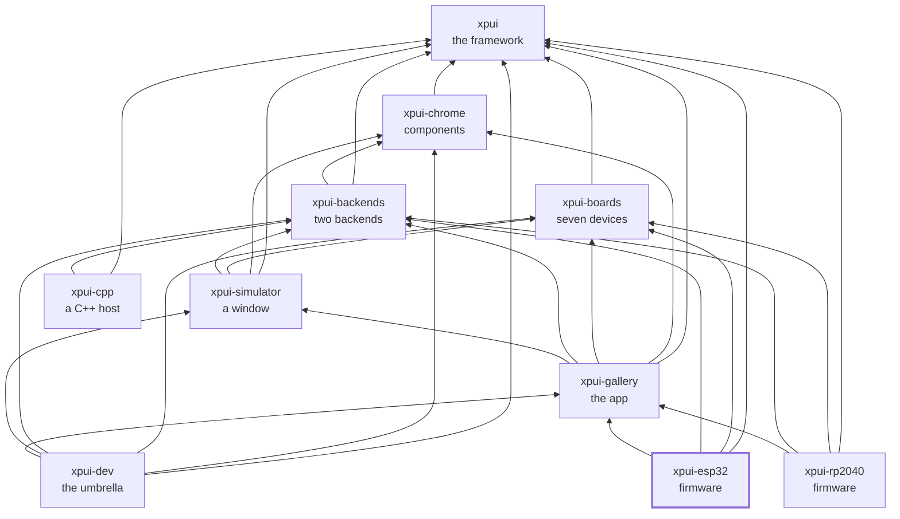

[](https://github.com/XPUI-Framework/xpui-esp32/actions/workflows/ci.yml) [](LICENSE)

# `xpui-esp32`

> [!WARNING]
> Under heavy development. Not production-ready. The API can break without
> notice. Use at your own risk.

The gallery as ESP32 firmware: two boards on two architectures, running the
same screens the desktop simulator opens and the RP2040 binaries flash. Both
images build and link; neither board has been run, and there is no panel
driver — `Panel::present` is where one goes, and
[docs/hardware.md](docs/hardware.md) says why it is marked rather than faked.

| Binary | Board | Chip | Target |
|---|---|---|---|
| `x3` | Xteink X3 | ESP32-C3 | `riscv32imc-unknown-none-elf` |
| `sticky` | Seeed Sticky | ESP32-S3 | `xtensa-esp32s3-none-elf` |

## Using it

For a firmware, using it is building it and flashing it. `--features` is not
optional: the chip is a feature of `esp-hal` rather than a target, so two
binaries in one crate cannot each choose their own, and `--all-features` is
two chips at once.

```bash
cargo build --release --bin x3 --features x3 --target riscv32imc-unknown-none-elf

. ~/export-esp.sh   # the Sticky's linker, on PATH for this shell
cargo +esp build --release --bin sticky --features sticky --target xtensa-esp32s3-none-elf
```

`.cargo/config.toml` names `espflash` as the runner for both targets, so
`cargo run` flashes the board and opens the serial monitor, where the firmware
reports its ink count on every repaint:

```bash
cargo run --release --bin x3 --features x3 --target riscv32imc-unknown-none-elf

. ~/export-esp.sh
cargo +esp run --release --bin sticky --features sticky --target xtensa-esp32s3-none-elf
```

The screens come from [`xpui-gallery`](https://github.com/XPUI-Framework/xpui-gallery),
the board's measurements from [`xpui-boards`](https://github.com/XPUI-Framework/xpui-boards),
the painting from [`xpui-backends`](https://github.com/XPUI-Framework/xpui-backends)'
`embedded_graphics`, and the framework from
[`xpui`](https://github.com/XPUI-Framework/xpui-framework). Nothing depends on
this repository: it is a leaf, an image for two boards.

## Requirements

- **The X3 builds on stable Rust.** `rust-toolchain.toml` lists
  `riscv32imc-unknown-none-elf`, so rustup installs it on the first cargo
  call.
- **The Sticky needs Espressif's compiler fork.** Xtensa is not a target
  stable Rust has: `cargo install espup && espup install` puts the `esp`
  toolchain and its linker in place, and `cargo +esp` selects it. `core` is
  built from source on that path. **`espup` does not touch your shell**, so
  `. ~/export-esp.sh` in each new one, or the build stops at
  ``linker `xtensa-esp32s3-elf-gcc` not found``. The gate finds that linker
  itself; a `cargo` line does not.
- **Flashing needs `espflash`**: `cargo install espflash`. Both boards flash
  over USB with no probe.

## Checking it

```bash
./build-and-test.sh          # format, lint for RISC-V, the prose, and the tutorial
./build-and-test.sh all      # plus linking both images
```

The checks themselves are in [`xtask/`](xtask/) — this repository's own list,
in Rust, holding nothing it does not run. `./build-and-test.sh fix` formats
in place first. The Xtensa image links only where the fork is installed, and
the gate says so when it is not. How a change is reviewed is in
[docs/contributing.md](docs/contributing.md).

## Where next

| | |
|---|---|
| [docs/tutorial.md](docs/tutorial.md) | your first screen on an ESP32: the board as data, the palette trap, the loop and the driver seam, memory, flashing — compiled by `docs-test/` |
| [docs/hardware.md](docs/hardware.md) | what runs and what does not, where the panel driver goes, memory, the two chips, and what the build taught |
| [docs/contributing.md](docs/contributing.md) | the target, the fork, `espflash`, the gate in both modes, the five review steps, and how a commit is written |

## Where it sits

Every arrow is a dependency in a `Cargo.toml`, and they all point inward
toward `xpui`, which depends on nothing at all. That is the rule the
organisation is arranged around: a backend can be written without the framework
knowing it exists, and a firmware reaches whatever it needs directly rather
than through whoever happens to sit above it.



## License

MIT — see [LICENSE](LICENSE). Copyright (c) 2026 Thiago Holanda.
