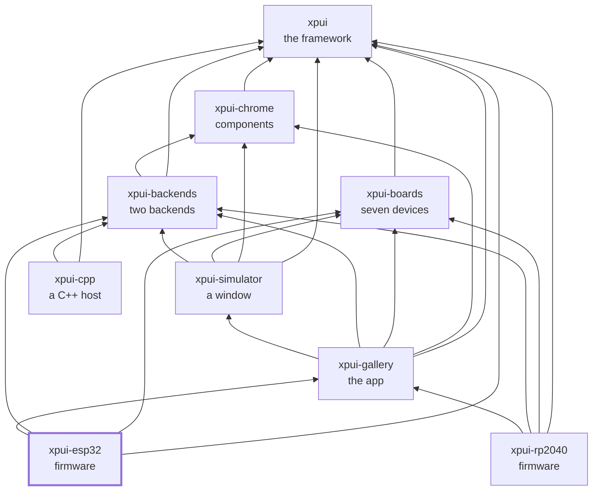

# The gallery, as ESP32 firmware

> ⚠️ **Under heavy development.** Not production-ready. The API can break
> without notice. Use at your own risk.

Two boards on two architectures, running the same screens the desktop
simulator opens and the RP2040 binaries flash.

| Binary | Board | Chip | Target |
|---|---|---|---|
| `x3` | Xteink X3 | ESP32-C3 | `riscv32imc-unknown-none-elf` |
| `sticky` | Seeed Sticky | ESP32-S3 | `xtensa-esp32s3-none-elf` |

```bash
cargo build --release --bin x3 --features x3 --target riscv32imc-unknown-none-elf

# The Sticky needs Espressif's compiler fork; see docs/devices.md.
cargo +esp build --release --bin sticky --features sticky --target xtensa-esp32s3-none-elf
```

`--features` is not optional: the chip is a feature of `esp-hal` rather than a
target, so two binaries in one crate cannot each choose their own.

## Everything but the last inch

Real and exercised by the build: the board's geometry, the chrome sized from
it, the frame loop, the allocator, the panic handler, and the whole gallery
laid out for the right panel. The firmware reports its ink count over the
serial port, which is how you can tell a frame reached pixels rather than
stopping in layout.

[`src/panel.rs`](src/panel.rs) owns the framebuffer and hands off at one
function, `Panel::present`. **That is where a panel driver goes**, and it is
marked rather than faked, for a reason worth having in front of you.

No published Rust or C++ driver exists for these panels. The RP2040 boards
could name `uc8151` and `mipidsi` because those are published crates; the X3
and the Sticky have no equivalent. The nearest working code is a hand-written
682-line SSD1677 driver in an unrelated project, tested against one specific
800×480 panel — which is exactly the framebuffer geometry both boards have.
Vendoring six hundred lines of hardware code into a repository that cannot
power a panel to test them would add something nobody here could verify.

**The gap is not meant to be closed here.** These panels already have firmware
that drives them, so a screen reaches an X3 or an X4 Pro by that firmware
hosting it over the C ABI — see
[`xpui-cpp`](https://github.com/XPUI-Framework/xpui-cpp) — rather than by this
repository growing a second driver for the same glass.

If you are building something else on this framework and do want one: both
boards need an SSD1677-class driver, strip-streamed rather than
double-buffered, and `Panel::present` is where it goes.

Everything above that line is real and is exercised by the build: the board's
geometry, the chrome sized from it, the frame loop, the allocator, the panic
handler, and the whole gallery laid out for the right panel. The firmware
reports its ink count over the serial port, which without a driver is the only
evidence a frame reached pixels rather than stopping in layout.

What is missing is the last step, and it is marked rather than faked.

## What the build taught us

Three things that cost a build each:

- `esp-backtrace` fails its own build script unless exactly one of `defmt` or
  `println` is enabled, and says so.
- The link fails without `esp-hal`'s `linkall.x`, on undefined interrupt
  symbols the vector table names. It is asked for in `build.rs` rather than
  `.cargo/config.toml`, so a build from the workspace root gets it too.
- **`-C force-frame-pointers` breaks the Xtensa build**, in LLVM, while
  compiling `compiler_builtins`. The C3 keeps it.

## What it depends on

The screens come from [`xpui-gallery`](https://github.com/XPUI-Framework/xpui-gallery) — the same library
the desktop simulator and the RP2040 firmware draw, which is the point: a
screen is written once. The board's measurements come from
[`xpui-boards`](https://github.com/XPUI-Framework/xpui-boards), the painting from
[`xpui-backends`](https://github.com/XPUI-Framework/xpui-backends)' `embedded_graphics`, and the framework
from [`xpui`](https://github.com/XPUI-Framework/xpui-framework).

Nothing depends on this repository. It is a leaf: an image, for two boards.

## Checking it

```bash
./build-and-test.sh          # format, lint for RISC-V, and the prose
./build-and-test.sh all      # plus linking both images
```

The checks themselves are in [`xtask/`](xtask/) — this repository's own list,
in Rust, holding nothing it does not run. `./build-and-test.sh fix` formats
in place first.

## Where it sits

Every arrow is a dependency in a `Cargo.toml`, and they all point inward
toward `xpui`, which depends on nothing at all. That is the rule the
organisation is arranged around: a backend can be written without the framework
knowing it exists, and a firmware reaches whatever it needs directly rather
than through whoever happens to sit above it.



## License

MIT — see [LICENSE](LICENSE). Copyright (c) 2026 Thiago Holanda.
